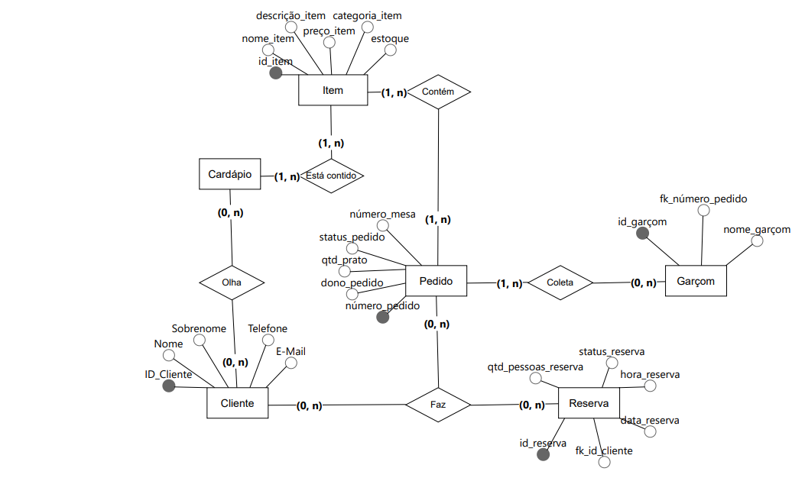

# Sistema de Controle de Restaurante

Este repositório contém a modelagem conceitual e lógica para o sistema de controle de operação de um restaurante. O sistema abrange o cadastro de clientes, gerenciamento de cardápio, processamento de pedidos e sistema de reservas.

## Modelo Conceitual

## Modelo Lógico
O modelo lógico do banco de dados pode ser encontrado na pasta [`restaurante`](./restaurante).

## Autores
- Gustavo Andrew Gomes da Silva
- João Pedro Carneiro da Silva
- Pedro Sales
- Vinícius Souza Pinto Sales Sobral
- Wilson Francisco do Nascimento
